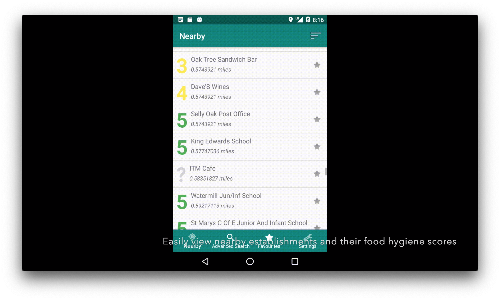
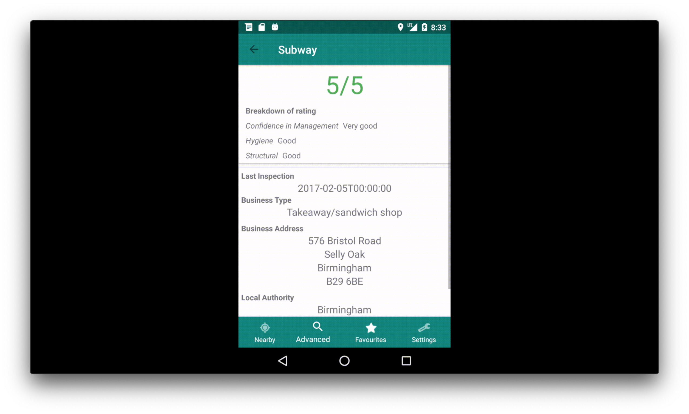
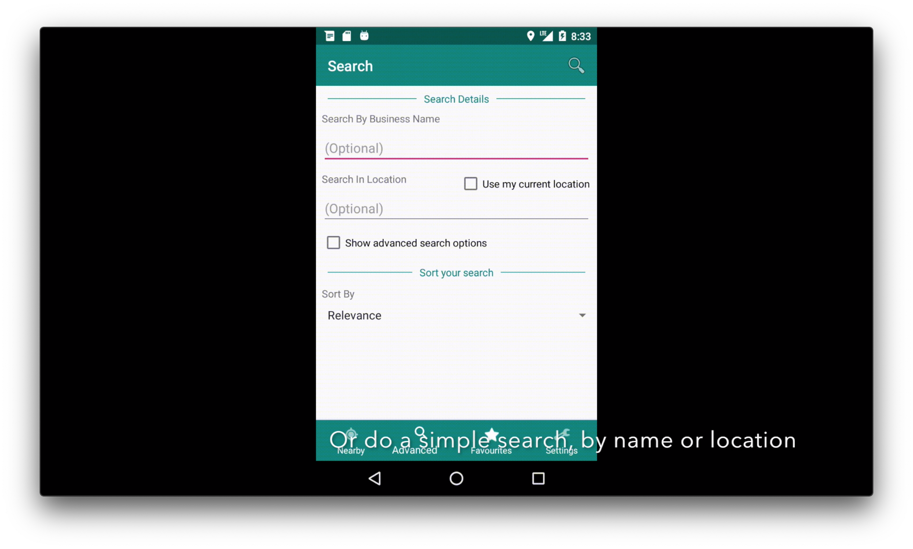
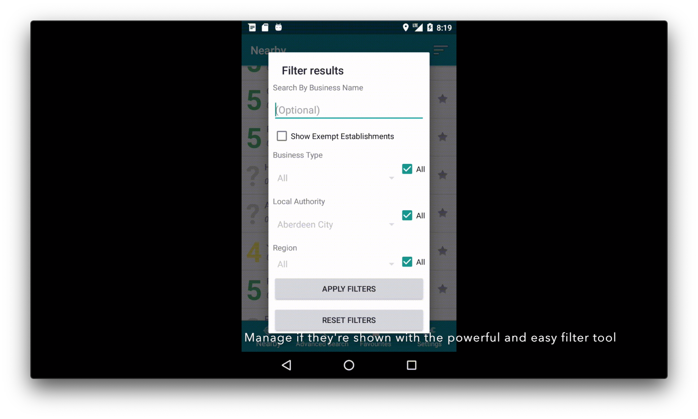

# android-FSA-food-hygiene
Android app to interact with the UK FSA API to view scores on the doors hygiene ratings of nearby restaurants,
for the Mobile and Ubiquitous Computing module. This app was designed with providing a good user experience in mind, and 
that the information wanted by a user was easily accessible. 

Here is a short (60 seconds) video of the app in action!
https://vimeo.com/337739908

Features:
 - Find nearby restaurants based on your location
 - Search for restaurants using more advanced filters options provided by the FSA API
 - Save your favourite restaurants, these are stored by the Room ORM in a SQLite database on the device to be viewed offline!
 - Apply filters to the search results once they have reached your device
 - Option to set a passcode for the app, if the app is in the background for more than 10 seconds it will lock and require the passcode next time

